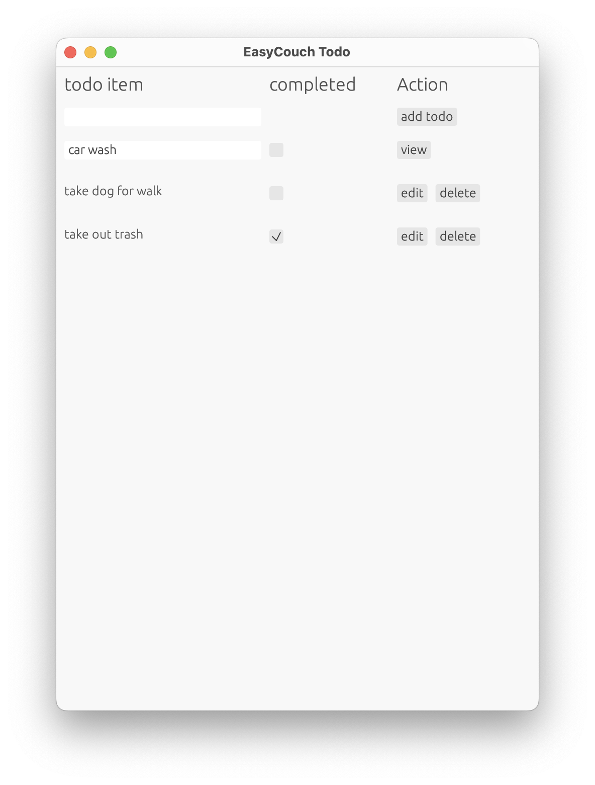

## easy_couch

EasyCouch is a simple and easy to use CouchDB client for rust. It is built on top of the couchdb_rs library and provides a simple interface to interact with CouchDB.

#### Egui Todo Example
The `examples/todo` directory contains a simple todo application that uses EasyCouch to interact with a CouchDB instance. The application uses the egui library for the GUI. To run the example, you need to have a CouchDB instance running.

